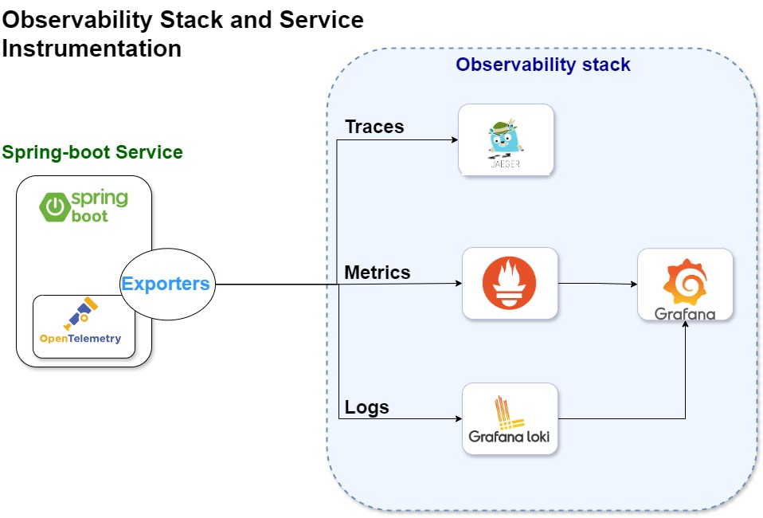
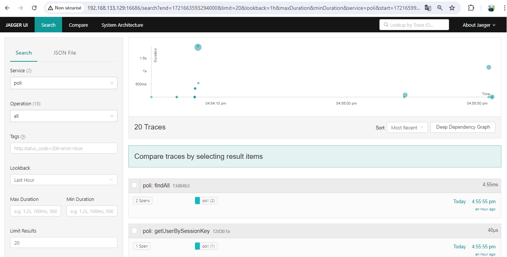
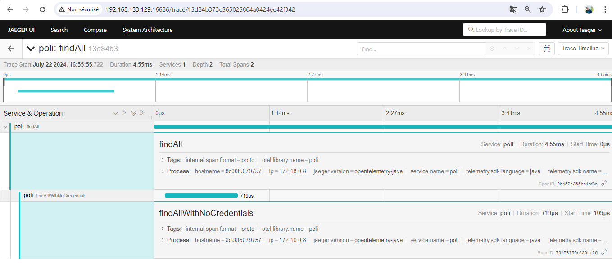

# Observability Stack and Service Instrumentation

## Overview

This project involves instrumenting a Java-based service with OpenTelemetry and setting up a compatible monitoring stack. The chosen stack includes Grafana, Jaeger, and Prometheus. The goal is to enable comprehensive tracing, metrics collection, and logging for enhanced observability of the service.

## Table of Contents

1. [Architecture](#Architecture)
2. [Infrastructure Setup](#infrastructure-setup)
3. [Service Instrumentation](#service-instrumentation)
4. [Metrics](#metrics)
5. [Dashboards and Alerts](#dashboards-and-alerts)
6. [Optional: Node Exporter](#optional-node-exporter)
7. [Conclusion](#conclusion)

## Architecture


## Infrastructure Setup

### Components

- **Grafana** : Grafana is an open-source platform for monitoring and observability. It provides tools to visualize, analyze, and alert on data from various sources, including metrics, logs, and traces.
  
- **Jaeger** : Jaeger is an open-source distributed tracing system used for monitoring and troubleshooting microservices-based architectures. It helps trace the flow of requests across various services to identify performance bottlenecks and failures.
  
- **Prometheus** : Prometheus is an open-source systems monitoring and alerting toolkit designed for reliability and scalability. It collects and stores time-series data, providing powerful querying capabilities and alerting ; collect metrics from various sources using pull-based mechanisms. Supports exporters and integrations for different systems.

- **Loki** : Loki is an open-source log aggregation system designed to work seamlessly with Grafana. It collects and stores logs, allowing for efficient querying and visualization of log data.

### Docker Compose Configuration

The observability stack is deployed using Docker Compose, featuring a robust setup that includes Jaeger, Prometheus, Grafana, and Loki. This configuration ensures comprehensive monitoring and tracing capabilities.
To maintain data integrity and ensure durability across container restarts, persistent data storage is configured using Docker volumes. This setup leverages bind mounts to ensure that critical data, such as logs, metrics, and tracing information, is preserved and accessible, even after containers are stopped or restarted

#### Docker Compose File

```yaml
version: '3.8'

services:
  poli:
    build: .
    ports:
      - "6688:6688"
      - "9091:9091"
    environment:
      - OTEL_EXPORTER_JAEGER_ENDPOINT=http://jaeger:14250
      - OTEL_EXPORTER_PROMETHEUS_PORT=9091
      - OTEL_EXPORTER_OTLP_ENDPOINT=http://otel-collector:4317
    depends_on:
      - jaeger
      - prometheus
      - grafana
      - loki
      - otel-collector

  jaeger:
    image: jaegertracing/all-in-one:1.31
    ports:
      - "6831:6831/udp"
      - "6832:6832/udp"
      - "5778:5778"
      - "16686:16686"
      - "14268:14268"
      - "14250:14250"
      - "9411:9411"
    volumes:
      - jaeger-storage:/var/lib/jaeger

  prometheus:
    image: prom/prometheus:latest
    volumes:
      - /home/challenge/Desktop/poli/prometheus.yml:/etc/prometheus/prometheus.yml
      - prometheus-data:/prometheus
    ports:
      - "9090:9090"

  grafana:
    image: grafana/grafana:latest
    ports:
      - "3000:3000"
    environment:
      - GF_SECURITY_ADMIN_PASSWORD=admin
    volumes:
      - grafana-storage:/var/lib/grafana
    depends_on:
      - loki
      - otel-collector

  loki:
    image: grafana/loki:latest
    ports:
      - "3100:3100"
    command: -config.file=/etc/loki/local-config.yaml
    volumes:
      - /home/challenge/Desktop/poli/local-config.yaml:/etc/loki/local-config.yaml
      - loki-data:/loki

  node-exporter:
    image: prom/node-exporter:v1.1.2
    ports:
      - "9100:9100"
    environment:
      - NODE_ID=poli-node
    extra_hosts:
      - "host.docker.internal:host-gateway"

volumes:
  grafana-storage:
  prometheus-data:
  loki-data:
  jaeger-storage:

```
### Service Instrumentation


#### What is Service Instrumentation?

Service instrumentation integrates observability tools into our services to collect and report metrics, traces, and logs. This process allows for better monitoring, troubleshooting, and optimization of our services.

#### What is OpenTelemetry?

OpenTelemetry is an open-source framework that provides APIs, libraries, and agents for collecting and exporting observability data such as traces, metrics, and logs. It is designed to provide consistent and interoperable observability data across various platforms and technologies.

#### Key Components:

- **Metrics Collection**: Captures quantitative data like response times, error rates, and resource utilization to monitor service performance and detect anomalies.

- **Tracing**: Tracks the flow of requests through the application, providing visibility into interactions between services and identifying performance bottlenecks.

- **Logging**: Records detailed logs to offer context for troubleshooting and debugging specific events within the service.

#### Benefits:

- **Enhanced Visibility**: Gain a comprehensive view of the `poli` application’s performance and behavior through detailed metrics, traces, and logs.

- **Real-Time Monitoring**: Detect and address issues such as latency and resource constraints as they occur.

- **Efficient Troubleshooting**: Use tracing and logging to quickly identify and resolve errors and performance issues.

- **Data-Driven Decisions**: Utilize metrics and traces to guide decisions on scaling, optimization, and service improvements.

- **Proactive Alerts**: Set up alerts based on metrics and logs to preemptively address potential issues.

- **Compliance and Reporting**: Maintain detailed logs and metrics for audits and compliance purposes.

- **Improved User Experience**: Optimize performance by identifying and addressing bottlenecks.

#### Implementation Details

1. **Cloning and Building**:
   - Cloned the `poli` application from its repository:
    
   ```bash
     git clone https://github.com/shzlw/poli.git
   ```

   - Build the application using Docker :

   ```bash
   cd poli
   docker build -t poli . 
   ```

3. **OpenTelemetry Configuration**:
   - Add OpenTelemetry SDK and API dependencies :
     ```bash
             <dependency>
            <groupId>io.opentelemetry</groupId>
            <artifactId>opentelemetry-api</artifactId>
            <version>1.12.0</version>
        </dependency>

        <dependency>
            <groupId>io.opentelemetry</groupId>
            <artifactId>opentelemetry-sdk</artifactId>
            <version>1.12.0</version>
        </dependency>
     ```
   - Configured the OpenTelemetry SDK inside the `config` package [OpenTelemetryConfiguration.java](https://github.com/mmhamdi/src/main/java/com/shzlw/poli/OpenTelemetryConfiguration.java) of the `poli` application:
     - **OpenTelemetry SDK Bean**:
       - **`OpenTelemetrySdk`**: Configured with tracing, logging, and metrics components.
       - **Tracer Provider**: Uses `SdkTracerProvider` with two span processors:
         - **Jaeger Exporter**: Sends traces to Jaeger for visualization.
         - **Logging Span Exporter**: Outputs trace information to logs for debugging.
       - **Log Emitter Provider**: Uses `SdkLogEmitterProvider` to send logs to an OTLP endpoint.
       - **Context Propagators**: Configured to use the W3C Trace Context for trace propagation.

    ```bash
    @Configuration
    public class OpenTelemetryConfiguration {
    @Bean
    public OpenTelemetrySdk getOpenTelemetry (){
        Resource serviceNameResource =
                Resource.create(Attributes.of(ResourceAttributes.SERVICE_NAME, "poli"));
        OpenTelemetrySdkBuilder openTelemetrySdkBuilder = OpenTelemetrySdk.builder()
                .setTracerProvider(
                        SdkTracerProvider.builder()
                                .addSpanProcessor(SimpleSpanProcessor.create(getJaegerExporter()))
                                .addSpanProcessor(SimpleSpanProcessor.create(LoggingSpanExporter.create()))
                                .setResource(Resource.getDefault().merge(serviceNameResource))
                                .build())
                .setPropagators(ContextPropagators.create(W3CTraceContextPropagator.getInstance()));
        return openTelemetrySdkBuilder.buildAndRegisterGlobal();
    }
    ``` 
   - Integrated OpenTelemetry with Jaeger for tracing, Prometheus for metrics:
  
   - **Add the specific dependencies for exporters** :
     ```bash
     <dependency>
            <groupId>io.opentelemetry</groupId>
            <artifactId>opentelemetry-exporter-jaeger</artifactId>
            <version>1.12.0</version>
     </dependency>
      <dependency>
            <groupId>io.opentelemetry</groupId>
            <artifactId>opentelemetry-exporter-prometheus</artifactId>
            <version>1.12.0-alpha</version>
     </dependency>
     <dependency>
            <groupId>io.opentelemetry</groupId>
            <artifactId>opentelemetry-exporter-otlp-logs</artifactId>
            <version>1.12.0-alpha</version>
        </dependency>
     ```
     
   - **Integrated OpenTelemetry with Jaeger for tracing**: 
     
     - **Jaeger Exporter**: Configured with endpoint `http://jaeger:14250` to send trace data to Jaeger for visualization.
       
   - **Prometheus for metrics**:
     
     - **Prometheus HTTP Server**: Set up on port 9091 to allow Prometheus to scrape and collect application metrics.
       
   - **OTLP for logging**:
     
     - **OTLP Log Exporter**: Configured to send logs to the OTLP collector endpoint at `http://otel-collector:4317`.


 5. **Tracing Implementation in Endpoints**:

Following the OpenTelemetry configuration, I have added detailed tracing to several key endpoints across different layers within the application: 
   - Controller: to Monitors HTTP request handling, tracks request processing time, and captures endpoint performance metrics.   
   - Service: Observes business logic execution and interactions between services.  
   - Repository: Focuses on database operations and query performance .

 - **Instrumented Endpoints**:
   
    - *Reports* : [ReportWs.java](https://github.com/mmhamdi/src/main/java/com/shzlw/poli/rest/ReportWs.java) ,[ReportService.java](https://github.com/mmhamdi/src/main/java/com/shzlw/poli/service/ReportService.java) , [ReportDao.java](https://github.com/mmhamdi/src/main/java/com/shzlw/poli/dao/ReportDao.java)

    - *JdbcDataSource* : [JdbcDataSourceWs.java](https://github.com/mmhamdi/src/main/java/com/shzlw/poli/rest/JdbcDataSourceWs.java) ,[JdbcDataSourceService.java](https://github.com/mmhamdi/src/main/java/com/shzlw/poli/service/JdbcDataSourceService.java) , [JdbcDataSourceDao.java](https://github.com/mmhamdi/src/main/java/com/shzlw/poli/dao/JdbcDataSourceDao.java)
        
    - *User* :  [ReportWs.java](https://github.com/mmhamdi/src/main/java/com/shzlw/poli/rest/UserWs.java) ,[UserService.java](https://github.com/mmhamdi/src/main/java/com/shzlw/poli/service/UserService.java) , [UserDao.java](https://github.com/mmhamdi/src/main/java/com/shzlw/poli/dao/UserDao.java)

## Testing Tracing in Jaeger

To ensure that tracing is correctly implemented and visible in Jaeger :

1.**deploying the application as a container**:
    - I choose to add it to the same docker-compose file of my observability stack to ensure that both containers run on same network.
```yaml
services:
  poli:
    build: .
    ports:
      - "6688:6688"
      - "9091:9091"
    environment:
      - OTEL_EXPORTER_JAEGER_ENDPOINT=http://jaeger:14250 
      - OTEL_EXPORTER_PROMETHEUS_PORT=9091
      - OTEL_EXPORTER_OTLP_ENDPOINT=http://otel-collector:4317
    depends_on:
      - jaeger
      - prometheus
      - grafana
      - loki
      - otel-collector
```

2.**Check Traces in Jaeger**
   - Open Jaeger's web interface at `http://localhost:16686`.
   - Navigate to the **"Search"** tab.
   - Select the service name configured  "poli".
    <p align="center">
      
    </p>
   - Analyze Trace Details:
    <p align="center">
      
    </p>
    
## Metrics

Custom metrics are integrated into the `poli` application to provide detailed insights into various aspects of the system's performance and operations. The `CustomMetrics` class, located in the `com.shzlw.poli.metrics` package, defines and manages these metrics. Below is an overview of the custom metrics and their integration across different application layers:

### CustomMetrics Class

The `CustomMetrics` class initializes and provides access to various custom metrics:

#### Counters
- **`requestCounter`**: Total number of HTTP requests.
- **`errorCounter`**: Total number of HTTP request errors.
- **`updateCounter`**: Total number of reports updates.
- **`dbQueryCounter`**: Total number of database queries executed.
- **`dbFailedQueryCounter`**: Total number of failed database queries.
- **`serviceMethodCounter`**: Total number of times a specific service method is called.
- **`serviceOperationSuccessCounter`**: Total number of successful service operations.
- **`serviceOperationFailureCounter`**: Total number of failed service operations.
- **`cacheHitCounter`**: Total number of cache hits.
- **`cacheMissCounter`**: Total number of cache misses.

#### UpDownCounters (used as gauges)
- **`activeSessionsCounter`**: Number of active user sessions.

#### Histograms
- **`requestSizeHistogram`**: Histogram of HTTP request sizes.

### Integration into Application Layers

Metrics are integrated across different layers of the application to provide comprehensive insights:

#### Controller Layer
- **HTTP Request Metrics**: Track the total number of requests and errors at the controller level using `requestCounter` and `errorCounter`.
- **Request Size**: Measure the size of HTTP requests with `requestSizeHistogram`.

#### Service Layer
- **Service Method Metrics**: Count the number of times a service method is called using `serviceMethodCounter`.
- **Service Operation Success and Failure**: Track successful and failed service operations with `serviceOperationSuccessCounter` and `serviceOperationFailureCounter`.

#### Repository Layer
- **Database Query Metrics**: Count the total number of database queries and failed queries using `dbQueryCounter` and `dbFailedQueryCounter`.
- **Cache Metrics**: Measure the performance of caching mechanisms with `cacheHitCounter` and `cacheMissCounter`.

This setup allows for detailed monitoring and analysis of application performance, helping identify and address potential issues efficiently.
### Testing Metrics in Prometheus

To ensure that the custom metrics are being collected and exposed correctly in Prometheus i configure prometheus.yml file :

```bash
global:
  scrape_interval: 15s
  evaluation_interval: 15s

scrape_configs:
  - job_name: 'poli-custom-metrics'
    metrics_path: '/'
    static_configs:
      - targets: ['poli:9091']
```
1.**Check Service Health in Prometheus** :

  </p>
   - Analyze Trace Details:
    <p align="center">
      
    </p>

